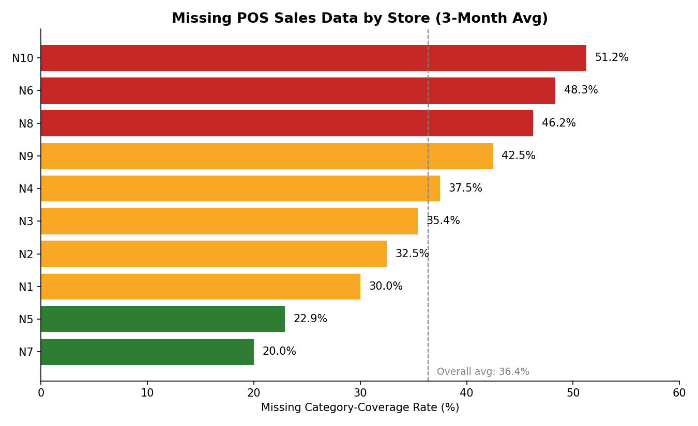

# Missing Data Analysis in Retail POS Systems

**Type:** Descriptive Analysis | **Tools:** Excel (formulas, pivot logic, charting), SQL | **Domain:** Retail / Point-of-Sale Data Quality

---

## Executive Summary

Analysis of transaction-level POS data across 10 retail stores found that **36.4% of expected product-category sales records were missing** over a 3-month period. The gap was concentrated in specific stores rather than specific months — Store N10 was missing over half its expected data (51.3%), while Store N7 was nearly complete (20.0% missing). This points to a **store-level data capture issue**, not a seasonal or company-wide one, and narrows where a data-quality intervention should be targeted.

---

## 1. Business Question

Which stores have the highest rate of missing or incomplete POS sales data, and does that rate vary by month?

**Why it matters:** Retailers use category-level sales data to drive stocking, staffing, and promotional decisions. Consistent gaps in that data — if concentrated in certain stores — signal a capture or process problem worth fixing at the source, rather than a data issue that can be safely ignored or averaged out.

## 2. Data Sources

| Dataset | Description | Rows |
|---|---|---|
| `Hackathon_Ideal_Data.csv` | Complete, aggregated monthly sales by store and category, across 10 reference stores (P1–P10). Defines the full expected set of 80 product categories. | 14,259 |
| `Hackathon_Working_Data.csv` | Raw, bill-level POS transactions for a separate set of 10 stores (N1–N10), with real-world reporting gaps. | 26,984 |
| `Hackathon_Validation_Data.csv` | Store–month–category combinations with no recorded sales value (the "unknowns" this analysis characterizes). | 2,429 |

Source: Nielsen Store Transaction Data (Kaggle), a dataset purpose-built to model incomplete retail POS reporting.

## 3. Methodology

1. **Aggregation** — Rolled up 26,984 raw transaction rows to total sales value by `MONTH × STORECODE × GRP` (category).
2. **Reference set** — Used the Ideal Data to define the 80 categories every store is expected to report against.
3. **Coverage check** — For each store-month, counted how many of the 80 expected categories had at least one recorded sale, using `COUNTIFS`.
4. **Missing rate** — Calculated as `(Expected − Present) ÷ Expected`, computed at both the store level and the month level.
5. **Verification** — All calculations are live formulas (no hardcoded outputs), so the workbook recalculates automatically if source data changes.
6. **SQL replication** — The same coverage-check logic (expected combinations minus present combinations via an anti-join, instead of `COUNTIFS`) is reproduced in [`analysis.sql`](analysis.sql), producing matching store- and month-level summaries.

**Analysis type:** Descriptive — this quantifies *what* is missing and *where*, without yet modeling *why* (a natural extension for follow-up work).

## 4. Findings

| Metric | Result |
|---|---|
| Overall missing rate | 36.4% (873 of 2,400 expected combinations) |
| Highest-gap store | N10 — 51.3% missing |
| Lowest-gap store | N7 — 20.0% missing |
| Missing rate by month | M1: 37.5% · M2: 36.0% · M3: 35.6% |

**Key insight:** Missing-data rate is essentially flat across months (a 1.9-point spread) but varies widely across stores (a 31-point spread, N7 to N10). The variance is store-driven, not time-driven — which rules out seasonal demand or a global reporting rollout issue as the root cause, and points to store-specific process or system gaps instead.

## 5. Limitations

- The Working Data's gaps are synthetic (built into the dataset for training purposes), so real-world root causes (e.g., specific POS terminal failures, staff turnover, network downtime) can't be diagnosed from this data alone.
- This analysis measures *category coverage* (whether a category was recorded at all), not *volume accuracy* (whether recorded sales match true sales) — a store could show 0% missing here while still under-reporting quantities.

## 6. Recommended Next Steps

1. Apply this same coverage-rate method to real internal capture-system data (e.g., comparing Integra, Push, and Manual entry systems) to test whether the same store-driven, month-stable pattern holds.
2. For the lowest-performing stores identified by this method, investigate specific causes (system downtime logs, staff process audits) rather than treating the gap as random.
3. Extend from descriptive to diagnostic analysis: test correlations between missing-rate and store attributes (size, region, staffing level) once that data is available.

---
*Analysis and workbook by Yogesh Kumar Mourya. Raw data and full formula-based calculations available in `Missing_Data_Analysis.xlsx` in this repository.*
